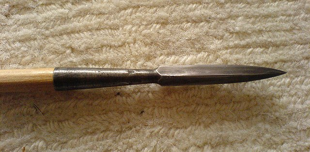

# Bodkin

<table>
    <tr>
        <td valign="top">
            <b>Bodkin</b> is a proc-macro to interface your application to the rest of the arrow ecosystem.
            It can be used to write training pipelines in Rust.  One of the meanings of bodkin is "arrow tip". 
        </td>
        <td valign="top">
            
        </td>
    </tr>
</table>

## Overview

Apache Arrow is a high performance in memory data representation. Arrow is
columnar based and code is frequently row based. This project assumes that the
user defines Rust structs for the row representation. It will provide 
proc macros to derive the batch representation as a struct of arrow arrays.

See the [docs](https://docs.rs/bodkin) for more informationl.
